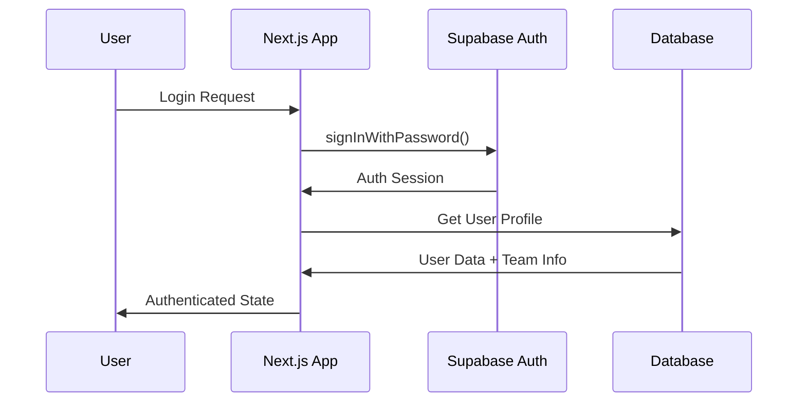

# Supabase Backend Documentation for GPT Desk

This comprehensive guide covers the complete Supabase backend implementation for the GPT Desk application, including architecture, API design, security, and deployment strategies.

## Table of Contents

1. [Architecture Overview](#architecture-overview)
2. [Database Schema](#database-schema)
3. [Security & Authentication](#security--authentication)
4. [API Services](#api-services)
5. [Real-time Features](#real-time-features)
6. [File Storage](#file-storage)
7. [Analytics & Monitoring](#analytics--monitoring)
8. [Deployment Guide](#deployment-guide)
9. [Performance Optimization](#performance-optimization)
10. [Troubleshooting](#troubleshooting)

## Architecture Overview

### System Architecture

```
┌─────────────────┐    ┌─────────────────┐    ┌─────────────────┐
│   Next.js App  │    │   Supabase      │    │   External APIs │
│                 │    │                 │    │                 │
│  ┌───────────┐  │    │  ┌───────────┐  │    │  ┌───────────┐  │
│  │ Frontend  │  │    │  │PostgreSQL │  │    │  │  OpenAI   │  │
│  │Components │◄─┼────┼─►│ Database  │  │    │  │    API    │  │
│  └───────────┘  │    │  └───────────┘  │    │  └───────────┘  │
│                 │    │                 │    │                 │
│  ┌───────────┐  │    │  ┌───────────┐  │    │  ┌───────────┐  │
│  │API Routes │  │    │  │   Auth    │  │    │  │   Other   │  │
│  │           │◄─┼────┼─►│  Service  │  │    │  │ Services  │  │
│  └───────────┘  │    │  └───────────┘  │    │  └───────────┘  │
│                 │    │                 │    │                 │
│  ┌───────────┐  │    │  ┌───────────┐  │    └─────────────────┘
│  │   Hooks   │  │    │  │  Storage  │  │
│  │           │◄─┼────┼─►│  Service  │  │
│  └───────────┘  │    │  └───────────┘  │
└─────────────────┘    └─────────────────┘
```

### Key Components

- **Frontend**: Next.js 14 with App Router
- **Database**: PostgreSQL via Supabase
- **Authentication**: Supabase Auth with RLS
- **Storage**: Supabase Storage for files
- **Real-time**: Supabase Realtime subscriptions
- **API Layer**: Custom TypeScript services

## Database Schema

### Core Tables

#### 1. Teams Table
```sql
CREATE TABLE teams (
    id UUID PRIMARY KEY DEFAULT uuid_generate_v4(),
    name VARCHAR(255) NOT NULL,
    description TEXT,
    created_at TIMESTAMP WITH TIME ZONE DEFAULT NOW(),
    updated_at TIMESTAMP WITH TIME ZONE DEFAULT NOW(),
    member_count INTEGER DEFAULT 0,
    settings JSONB DEFAULT '{}'::jsonb
);
```

**Purpose**: Multi-tenant organization structure
**Key Features**: 
- Automatic member count tracking
- Flexible settings storage
- Audit timestamps

#### 2. Users Table
```sql
CREATE TABLE users (
    id UUID PRIMARY KEY REFERENCES auth.users(id) ON DELETE CASCADE,
    email VARCHAR(255) UNIQUE NOT NULL,
    full_name VARCHAR(255) NOT NULL,
    role user_role DEFAULT 'user',
    team_id UUID REFERENCES teams(id) ON DELETE SET NULL,
    avatar_url TEXT,
    status VARCHAR(50) DEFAULT 'active',
    last_active TIMESTAMP WITH TIME ZONE DEFAULT NOW(),
    created_at TIMESTAMP WITH TIME ZONE DEFAULT NOW(),
    updated_at TIMESTAMP WITH TIME ZONE DEFAULT NOW(),
    preferences JSONB DEFAULT '{}'::jsonb
);
```

**Purpose**: Extended user profiles linked to Supabase Auth
**Key Features**:
- Role-based access control
- Team membership
- Activity tracking
- Customizable preferences

#### 3. GPTs Table
```sql
CREATE TABLE gpts (
    id UUID PRIMARY KEY DEFAULT uuid_generate_v4(),
    name VARCHAR(255) NOT NULL,
    description TEXT,
    category VARCHAR(100),
    status gpt_status DEFAULT 'active',
    creator_id UUID REFERENCES users(id) ON DELETE SET NULL,
    team_id UUID REFERENCES teams(id) ON DELETE CASCADE,
    -- Configuration
    prompt TEXT,
    model VARCHAR(100) DEFAULT 'gpt-4',
    temperature DECIMAL(3,2) DEFAULT 0.7,
    max_tokens INTEGER DEFAULT 2000,
    -- Metadata
    usage_count INTEGER DEFAULT 0,
    rating DECIMAL(3,2) DEFAULT 0.0,
    tags TEXT[] DEFAULT '{}',
    is_public BOOLEAN DEFAULT false,
    web_access BOOLEAN DEFAULT false,
    -- Governance
    approval_status approval_status DEFAULT 'pending',
    risk_level risk_level DEFAULT 'low',
    access_level access_level DEFAULT 'team',
    compliance_score INTEGER DEFAULT 0,
    monthly_cost DECIMAL(10,2) DEFAULT 0.00,
    settings JSONB DEFAULT '{}'::jsonb,
    created_at TIMESTAMP WITH TIME ZONE DEFAULT NOW(),
    updated_at TIMESTAMP WITH TIME ZONE DEFAULT NOW()
);
```

**Purpose**: AI assistant definitions with governance
**Key Features**:
- Model configuration
- Usage analytics
- Approval workflows
- Risk assessment
- Cost tracking

#### 4. Chat Sessions Table
```sql
CREATE TABLE chat_sessions (
    id UUID PRIMARY KEY DEFAULT uuid_generate_v4(),
    title VARCHAR(500) NOT NULL,
    user_id UUID REFERENCES users(id) ON DELETE CASCADE,
    gpt_id UUID REFERENCES gpts(id) ON DELETE CASCADE,
    status chat_status DEFAULT 'active',
    created_at TIMESTAMP WITH TIME ZONE DEFAULT NOW(),
    updated_at TIMESTAMP WITH TIME ZONE DEFAULT NOW(),
    message_count INTEGER DEFAULT 0,
    context JSONB DEFAULT '{}'::jsonb,
    settings JSONB DEFAULT '{}'::jsonb
);
```

**Purpose**: Conversation management
**Key Features**:
- Automatic message counting
- Context preservation
- Session lifecycle management

#### 5. Chat Messages Table
```sql
CREATE TABLE chat_messages (
    id UUID PRIMARY KEY DEFAULT uuid_generate_v4(),
    session_id UUID REFERENCES chat_sessions(id) ON DELETE CASCADE,
    sender message_sender NOT NULL,
    content TEXT NOT NULL,
    created_at TIMESTAMP WITH TIME ZONE DEFAULT NOW(),
    metadata JSONB DEFAULT '{}'::jsonb,
    tokens_used INTEGER DEFAULT 0,
    response_time_ms INTEGER DEFAULT 0
);
```

**Purpose**: Individual message storage
**Key Features**:
- Performance metrics
- Flexible metadata
- Token tracking

### Analytics Tables

#### Usage Analytics
```sql
CREATE TABLE usage_analytics (
    id UUID PRIMARY KEY DEFAULT uuid_generate_v4(),
    user_id UUID REFERENCES users(id) ON DELETE CASCADE,
    gpt_id UUID REFERENCES gpts(id) ON DELETE CASCADE,
    session_id UUID REFERENCES chat_sessions(id) ON DELETE CASCADE,
    team_id UUID REFERENCES teams(id) ON DELETE CASCADE,
    tokens_used INTEGER DEFAULT 0,
    response_time_ms INTEGER DEFAULT 0,
    cost DECIMAL(10,4) DEFAULT 0.0000,
    created_at TIMESTAMP WITH TIME ZONE DEFAULT NOW(),
    date DATE DEFAULT CURRENT_DATE,
    metrics JSONB DEFAULT '{}'::jsonb
);
```

#### Audit Logs
```sql
CREATE TABLE audit_logs (
    id UUID PRIMARY KEY DEFAULT uuid_generate_v4(),
    user_id UUID REFERENCES users(id) ON DELETE SET NULL,
    action VARCHAR(100) NOT NULL,
    resource_type VARCHAR(100) NOT NULL,
    resource_id UUID,
    details JSONB DEFAULT '{}'::jsonb,
    ip_address INET,
    user_agent TEXT,
    created_at TIMESTAMP WITH TIME ZONE DEFAULT NOW()
);
```

### Custom Types and Enums

```sql
-- User roles
CREATE TYPE user_role AS ENUM ('user', 'admin', 'super_admin');

-- GPT statuses
CREATE TYPE gpt_status AS ENUM ('active', 'inactive', 'pending', 'suspended');

-- Chat statuses
CREATE TYPE chat_status AS ENUM ('active', 'completed', 'archived');

-- Message senders
CREATE TYPE message_sender AS ENUM ('user', 'gpt');

-- Approval statuses
CREATE TYPE approval_status AS ENUM ('approved', 'pending', 'rejected');

-- Risk levels
CREATE TYPE risk_level AS ENUM ('low', 'medium', 'high');

-- Access levels
CREATE TYPE access_level AS ENUM ('team', 'organization');
```

## Security & Authentication

### Row Level Security (RLS) Policies

#### Team-based Data Isolation

```sql
-- Users can only see their team's GPTs
CREATE POLICY "Users can view team and public GPTs" ON gpts
    FOR SELECT USING (
        team_id = get_user_team_id(auth.uid()) OR 
        is_public = true OR
        is_super_admin(auth.uid())
    );
```

#### Role-based Access Control

```sql
-- Only admins can manage team users
CREATE POLICY "Admins can update team users" ON users
    FOR UPDATE USING (
        is_admin_or_super(auth.uid()) AND 
        team_id = get_user_team_id(auth.uid())
    );
```

#### Helper Functions

```sql
-- Get user's role
CREATE OR REPLACE FUNCTION get_user_role(user_uuid UUID)
RETURNS user_role AS $$
BEGIN
    RETURN (SELECT role FROM users WHERE id = user_uuid);
END;
$$ LANGUAGE plpgsql SECURITY DEFINER;

-- Check if user is super admin
CREATE OR REPLACE FUNCTION is_super_admin(user_uuid UUID)
RETURNS BOOLEAN AS $$
BEGIN
    RETURN (SELECT role FROM users WHERE id = user_uuid) = 'super_admin';
END;
$$ LANGUAGE plpgsql SECURITY DEFINER;
```

### Authentication Flow



## API Services

### Service Architecture

Each API service follows a consistent pattern:

```typescript
export class ServiceAPI {
  private supabase = createSupabaseClient()

  // CRUD operations
  async getItems(filters?: FilterOptions) { }
  async getItem(id: string) { }
  async createItem(data: InsertType) { }
  async updateItem(id: string, updates: UpdateType) { }
  async deleteItem(id: string) { }

  // Utility methods
  async getStats() { }
  async search(query: string) { }

  // Private helpers
  private async logAction() { }
}
```

### GPTs API Service

```typescript
// lib/supabase/api/gpts.ts
export class GPTsAPI {
  // Get GPTs with advanced filtering
  async getGPTs(filters?: {
    teamId?: string
    status?: string
    category?: string
    search?: string
    limit?: number
    offset?: number
  }) {
    // Implementation with RLS enforcement
  }

  // Get usage statistics
  async getGPTStats(gptId: string, dateRange?: DateRange) {
    // Analytics aggregation
  }

  // Rate a GPT
  async rateGPT(gptId: string, rating: number) {
    // Rating calculation and update
  }
}
```

### Chat API Service

```typescript
// lib/supabase/api/chat.ts
export class ChatAPI {
  // Session management
  async getChatSessions(filters?: SessionFilters) { }
  async createChatSession(session: SessionInsert) { }
  
  // Message handling
  async addChatMessage(message: MessageInsert) {
    // Automatic usage analytics recording
  }

  // Search functionality
  async searchMessages(query: string, filters?: SearchFilters) {
    // Full-text search across messages
  }
}
```

### Analytics API Service

```typescript
// lib/supabase/api/analytics.ts
export class AnalyticsAPI {
  // Usage analytics
  async getUsageStats(filters?: AnalyticsFilters) {
    // Multi-dimensional aggregation
  }

  // Cost analysis
  async getCostAnalysis(filters?: CostFilters) {
    // Financial reporting
  }

  // Dashboard metrics
  async getDashboardMetrics(teamId?: string, dateRange?: DateRange) {
    // Comprehensive KPIs
  }
}
```

## Real-time Features

### Supabase Realtime Integration

```typescript
// Real-time chat messages
const supabase = createSupabaseClient()

useEffect(() => {
  const channel = supabase
    .channel('chat-messages')
    .on(
      'postgres_changes',
      {
        event: 'INSERT',
        schema: 'public',
        table: 'chat_messages',
        filter: `session_id=eq.${sessionId}`
      },
      (payload) => {
        setMessages(prev => [...prev, payload.new])
      }
    )
    .subscribe()

  return () => {
    supabase.removeChannel(channel)
  }
}, [sessionId])
```

### Real-time Notifications

```typescript
// Team activity notifications
const channel = supabase
  .channel('team-activity')
  .on(
    'postgres_changes',
    {
      event: '*',
      schema: 'public',
      table: 'gpts',
      filter: `team_id=eq.${teamId}`
    },
    (payload) => {
      // Handle GPT changes
      handleGPTUpdate(payload)
    }
  )
  .subscribe()
```

## File Storage

### Storage Configuration

```typescript
// lib/supabase/api/documents.ts
export class DocumentsAPI {
  // Upload file to Supabase Storage
  async uploadFile(file: File, bucket = 'gpt-desk-files', folder = 'documents') {
    const fileExt = file.name.split('.').pop()
    const fileName = `${folder}/${Date.now()}-${Math.random().toString(36).substring(2)}.${fileExt}`

    const { data, error } = await this.supabase.storage
      .from(bucket)
      .upload(fileName, file)

    if (error) throw error

    // Get public URL
    const { data: { publicUrl } } = this.supabase.storage
      .from(bucket)
      .getPublicUrl(fileName)

    return { 
      data: { 
        path: data.path, 
        publicUrl,
        fileName: file.name,
        fileSize: file.size,
        fileType: file.type
      }, 
      error: null 
    }
  }
}
```

### Storage Policies

```sql
-- Allow authenticated users to upload files
CREATE POLICY "Users can upload files" ON storage.objects
  FOR INSERT WITH CHECK (auth.role() = 'authenticated');

-- Users can view files from their team
CREATE POLICY "Users can view team files" ON storage.objects
  FOR SELECT USING (
    auth.uid() IN (
      SELECT user_id FROM documents 
      WHERE file_url LIKE '%' || name || '%'
      AND team_id = get_user_team_id(auth.uid())
    )
  );
```

## Analytics & Monitoring

### Usage Analytics Dashboard

```typescript
// Dashboard metrics calculation
const getDashboardMetrics = async (teamId?: string, dateRange?: DateRange) => {
  const [usageStats, costAnalysis, activeUsers, topGPTs] = await Promise.all([
    getUsageStats({ teamId, dateRange }),
    getCostAnalysis({ teamId, dateRange }),
    getActiveUsers(teamId, dateRange),
    getTopGPTs(teamId, dateRange)
  ])

  return {
    usage: usageStats,
    costs: costAnalysis,
    activeUsers,
    topGPTs,
    trends: calculateTrends(usageStats, dateRange)
  }
}
```

### Cost Tracking

```typescript
// Automatic cost calculation
const recordUsageAnalytics = async (sessionId: string, metrics: UsageMetrics) => {
  // Calculate cost based on model and tokens
  const costPerToken = MODEL_COSTS[model] || 0.000002
  const cost = metrics.tokens_used * costPerToken

  await supabase
    .from('usage_analytics')
    .insert({
      user_id: session.user_id,
      gpt_id: session.gpt_id,
      session_id: sessionId,
      team_id: session.team_id,
      tokens_used: metrics.tokens_used,
      response_time_ms: metrics.response_time_ms,
      cost,
      metrics: {
        model,
        ...metrics
      }
    })
}
```

### Audit Logging

```typescript
// Automatic audit logging
const logAction = async (action: string, resourceType: string, resourceId: string, details?: any) => {
  await supabase
    .from('audit_logs')
    .insert({
      action,
      resource_type: resourceType,
      resource_id: resourceId,
      details: details || {},
      ip_address: getClientIP(),
      user_agent: getUserAgent()
    })
}
```

## Deployment Guide

### Environment Configuration

```bash
# Production environment variables
NEXT_PUBLIC_SUPABASE_URL=https://your-project.supabase.co
NEXT_PUBLIC_SUPABASE_ANON_KEY=your_anon_key
SUPABASE_SERVICE_ROLE_KEY=your_service_role_key
OPENAI_API_KEY=your_openai_key

# Optional: Custom domain
NEXT_PUBLIC_SUPABASE_CUSTOM_DOMAIN=api.yourdomain.com
```

### Database Migration Strategy

```sql
-- Migration versioning
CREATE TABLE schema_migrations (
    version VARCHAR(255) PRIMARY KEY,
    applied_at TIMESTAMP WITH TIME ZONE DEFAULT NOW()
);

-- Example migration
INSERT INTO schema_migrations (version) VALUES ('001_initial_schema');
```

### Production Checklist

- [ ] **Database Setup**
  - [ ] Run schema.sql
  - [ ] Apply RLS policies
  - [ ] Set up indexes
  - [ ] Configure backups

- [ ] **Authentication**
  - [ ] Configure email templates
  - [ ] Set up OAuth providers (if needed)
  - [ ] Configure password policies
  - [ ] Set up MFA (if required)

- [ ] **Storage**
  - [ ] Create storage buckets
  - [ ] Configure storage policies
  - [ ] Set up CDN (if needed)
  - [ ] Configure file size limits

- [ ] **Security**
  - [ ] Review RLS policies
  - [ ] Set up rate limiting
  - [ ] Configure CORS
  - [ ] Enable SSL/TLS

- [ ] **Monitoring**
  - [ ] Set up logging
  - [ ] Configure alerts
  - [ ] Monitor performance
  - [ ] Track usage metrics

## Performance Optimization

### Database Optimization

```sql
-- Optimize frequently queried columns
CREATE INDEX CONCURRENTLY idx_gpts_team_status ON gpts(team_id, status);
CREATE INDEX CONCURRENTLY idx_chat_sessions_user_updated ON chat_sessions(user_id, updated_at DESC);
CREATE INDEX CONCURRENTLY idx_usage_analytics_date_team ON usage_analytics(date, team_id);

-- Partial indexes for better performance
CREATE INDEX CONCURRENTLY idx_active_gpts ON gpts(team_id) WHERE status = 'active';
```

### Query Optimization

```typescript
// Use select() to limit returned columns
const { data } = await supabase
  .from('gpts')
  .select('id, name, description, usage_count')
  .eq('team_id', teamId)
  .eq('status', 'active')
  .order('usage_count', { ascending: false })
  .limit(10)
```

### Caching Strategy

```typescript
// React Query for client-side caching
import { useQuery } from '@tanstack/react-query'

const useGPTs = (teamId: string) => {
  return useQuery({
    queryKey: ['gpts', teamId],
    queryFn: () => gptsAPI.getGPTs({ teamId }),
    staleTime: 5 * 60 * 1000, // 5 minutes
    cacheTime: 10 * 60 * 1000, // 10 minutes
  })
}
```

### Connection Pooling

```typescript
// Supabase client configuration
const supabase = createClient(url, key, {
  db: {
    schema: 'public',
  },
  auth: {
    autoRefreshToken: true,
    persistSession: true,
  },
  global: {
    headers: { 'x-my-custom-header': 'my-app-name' },
  },
})
```

## Troubleshooting

### Common Issues

#### 1. RLS Policy Errors
```
Error: new row violates row-level security policy
```

**Solution**: Check RLS policies and ensure user has proper team assignment
```sql
-- Debug RLS policies
SELECT * FROM pg_policies WHERE tablename = 'your_table';
```

#### 2. Authentication Issues
```
Error: Invalid JWT token
```

**Solution**: Check token expiration and refresh logic
```typescript
// Automatic token refresh
supabase.auth.onAuthStateChange((event, session) => {
  if (event === 'TOKEN_REFRESHED') {
    console.log('Token refreshed successfully')
  }
})
```

#### 3. Performance Issues
```
Query taking too long to execute
```

**Solution**: Add appropriate indexes and optimize queries
```sql
-- Analyze query performance
EXPLAIN ANALYZE SELECT * FROM gpts WHERE team_id = 'uuid';
```

### Debugging Tools

#### 1. Supabase Dashboard
- Monitor real-time database activity
- View query performance
- Check authentication logs
- Monitor storage usage

#### 2. Database Logs
```sql
-- Enable query logging
ALTER SYSTEM SET log_statement = 'all';
SELECT pg_reload_conf();
```

#### 3. Client-side Debugging
```typescript
// Enable debug mode
const supabase = createClient(url, key, {
  auth: {
    debug: process.env.NODE_ENV === 'development'
  }
})
```

### Performance Monitoring

```typescript
// Custom performance monitoring
const performanceMonitor = {
  async trackQuery(queryName: string, queryFn: () => Promise<any>) {
    const startTime = Date.now()
    try {
      const result = await queryFn()
      const duration = Date.now() - startTime
      
      // Log performance metrics
      console.log(`Query ${queryName} took ${duration}ms`)
      
      return result
    } catch (error) {
      const duration = Date.now() - startTime
      console.error(`Query ${queryName} failed after ${duration}ms:`, error)
      throw error
    }
  }
}
```

## Best Practices

### 1. Security
- Always use RLS policies
- Validate input on both client and server
- Use service role key only on server-side
- Implement proper error handling without exposing sensitive data

### 2. Performance
- Use indexes for frequently queried columns
- Implement pagination for large datasets
- Use select() to limit returned columns
- Cache frequently accessed data

### 3. Data Modeling
- Use UUIDs for primary keys
- Implement soft deletes where appropriate
- Use JSONB for flexible schema requirements
- Maintain referential integrity with foreign keys

### 4. API Design
- Follow RESTful conventions
- Implement consistent error handling
- Use TypeScript for type safety
- Document API endpoints thoroughly

### 5. Monitoring
- Track usage metrics and costs
- Monitor query performance
- Set up alerts for critical issues
- Maintain audit logs for compliance

This comprehensive Supabase backend provides a robust, scalable foundation for your GPT Desk application with enterprise-grade features including security, analytics, and monitoring capabilities.